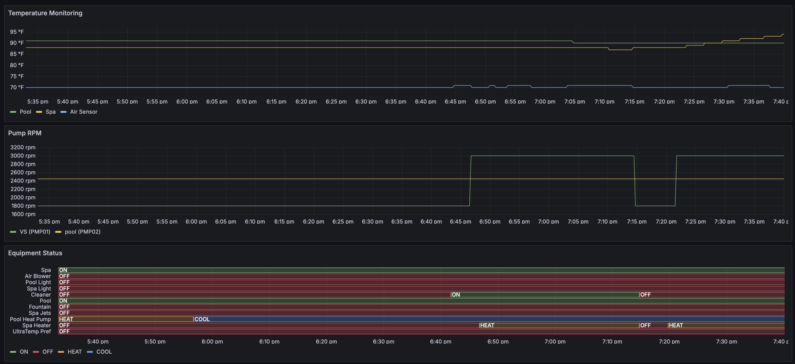

# Pentameter - Pool Temperature Monitor

Pentameter is a Prometheus exporter for Pentair IntelliCenter pool controllers that connects via WebSocket and exposes pool equipment data as Prometheus metrics with pre-configured Grafana dashboards for visualization.

## Features

### Real-Time Data Collection
- **Temperature Monitoring**: Pool, spa, and outdoor air sensors
- **Pump Monitoring**: Variable speed RPM and flow rates  
- **Equipment Status**: Circuit and feature on/off states
- **Connection Health**: Automatic failure detection and recovery

### Data Export and Visualization
- **Prometheus Metrics**: Standard format compatible with any monitoring tool
- **Pre-configured Dashboards**: Grafana dashboards with automatic provisioning
- **Kiosk Mode**: Clean displays for dedicated monitoring screens
- **Historical Trends**: Long-term data visualization and analysis

### Smart Features
- **Intelligent Filtering**: Focus on meaningful equipment vs virtual controls
- **Graceful Degradation**: Handle missing sensors without errors
- **Browser Compatibility**: Standard metrics endpoint works everywhere

### Technical Features
- WebSocket connection to IntelliCenter controllers
- Robust connection management with exponential backoff retry logic
- Health checks with automatic reconnection on failures
- Configurable via command line flags or environment variables
- Health check endpoint

## Architecture Overview

Pentameter connects to IntelliCenter controllers via WebSocket and transforms pool data into standard Prometheus metrics for monitoring and alerting.

### System Components

1. **Go Service** - Core monitoring service
   - WebSocket client for IntelliCenter communication
   - Prometheus metrics endpoint (`/metrics`)
   - Health checks and connection management

2. **IntelliCenter Interface**
   - WebSocket connection (default port 6680)
   - JSON message protocol using GetParamList API
   - Exponential backoff retry with health checks

3. **Metrics Export**
   - HTTP server (default port 8080)
   - Standard Prometheus format
   - Compatible with any monitoring tool

4. **Docker Deployment**
   - Multi-stage builds with scratch base images (~10MB)
   - Docker Compose orchestration
   - Prometheus and Grafana included

### Technology Stack

- **Language:** Go with standard library HTTP server
- **WebSocket:** `github.com/gorilla/websocket`
- **Metrics:** `github.com/prometheus/client_golang`
- **Build:** Makefile with Docker integration
- **Deployment:** Docker Compose with restart policies

## Installation

> **Note**: Pentameter is currently in early development. Pre-built binaries and Docker images are not yet available, so you must build locally using the provided Makefile.

```bash
git clone git@github.com:astrostl/pentameter.git
cd pentameter
go mod tidy
```

## Configuration

All configuration options can be set via command line flags or environment variables:

| Flag | Environment Variable | Default | Description |
|------|---------------------|---------|-------------|
| `--ic-ip` | `PENTAMETER_IC_IP` | (required) | IntelliCenter IP address |
| `--ic-port` | `PENTAMETER_IC_PORT` | `6680` | IntelliCenter WebSocket port |
| `--http-port` | `PENTAMETER_HTTP_PORT` | `8080` | HTTP server port for metrics |
| `--interval` | `PENTAMETER_INTERVAL` | `300` | Temperature polling interval (seconds) |

## Usage

### Command Line Flags
```bash
go run main.go --ic-ip 192.168.192.168 --ic-port 6680 --http-port 8080 --interval 300
```

### Environment Variables
```bash
export PENTAMETER_IC_IP=192.168.192.168
export PENTAMETER_IC_PORT=6680
export PENTAMETER_HTTP_PORT=8080
export PENTAMETER_INTERVAL=300
go run main.go
```

### Mixed Configuration
```bash
# Use environment for IP, override HTTP port via flag
export PENTAMETER_IC_IP=192.168.192.168
go run main.go --http-port 9090
```

## Endpoints

- **Metrics**: `http://localhost:8080/metrics` - Prometheus metrics
- **Health**: `http://localhost:8080/health` - Health check
- **Prometheus**: `http://localhost:9090` - Prometheus web interface
- **Grafana**: `http://localhost:3000` - Grafana dashboards (no login required)
- **Kiosk Mode**: `http://localhost:3000/d/pool-monitoring?kiosk` - Clean dashboard display

## Metrics Reference

### Temperature Metrics
```prometheus
# Water temperatures
water_temperature_fahrenheit{body="POOL",name="Pool"} 87
water_temperature_fahrenheit{body="SPA",name="Spa"} 84

# Air temperature (optional)
air_temperature_fahrenheit{sensor="AIR",name="Air Sensor"} 73
```

### Equipment Metrics
```prometheus
# Pump speeds and flow
pump_rpm{pump="PMP01",name="VS"} 3000
pump_rpm{pump="PMP02",name="pool"} 2450

# Circuit status (1=on, 0=off)
circuit_status{circuit="C0001",name="Spa",type="SPA"} 1
circuit_status{circuit="C0003",name="Pool Light",type="LIGHT"} 0
circuit_status{circuit="FTR01",name="Spa Heat",type="GENERIC"} 0
```

### System Health Metrics
```prometheus
# Connection monitoring
intellicenter_connection_failure 0
intellicenter_last_refresh_timestamp_seconds 1719636177
```

### Data Sources

| Metric Type | Source | API Query | Parameter |
|-------------|--------|-----------|------------|
| Water Temperature | Pool/Spa bodies | OBJTYP=BODY | TEMP |
| Air Temperature | Outdoor sensor | Object _A135 | PROBE |
| Pump RPM | Variable speed pumps | OBJTYP=PUMP | RPM |
| Circuit Status | Equipment controls | OBJTYP=CIRCUIT | STATUS |
| Connection Health | Internal monitoring | N/A | Health checks |
| Refresh Timestamp | Internal tracking | N/A | Unix timestamp |

## Connection Reliability

### Automatic Recovery
- **Exponential Backoff**: 1s → 2s → 4s → 8s → 16s → 30s max
- **Health Checks**: WebSocket ping/pong every 30 seconds
- **Retry Limits**: Maximum 5 attempts before giving up
- **Graceful Degradation**: Continue operation during connection issues

### Configuration
```go
RetryConfig{
    MaxRetries:      5,
    BaseDelay:       1 * time.Second,
    MaxDelay:        30 * time.Second,
    BackoffFactor:   2.0,
    HealthCheckRate: 30 * time.Second,
}
```

## Smart Circuit Filtering

Pentameter filters IntelliCenter's ~35 circuits down to ~9 meaningful equipment items:

**Included (Useful Equipment):**
- **C-prefixed**: Core equipment (Pool, Spa, Lights, Cleaner)
- **FTR-prefixed**: Features (Spa Heat, Fountain, Spa Jets)

**Excluded (Virtual Controls):**
- **AUX circuits**: Unused placeholder circuits
- **X-prefixed**: Virtual buttons (Pump Speed +/-)
- **_A-prefixed**: Action commands (All Lights On/Off)
- **Duplicates**: Multiple entries for same equipment

## Building

### Using Makefile (Recommended)
```bash
# Build the binary
make build

# Build Docker image
make docker

# Run with Docker Compose
make compose-up

# View all available targets
make help
```

### Manual Build
```bash
go build -o pentameter main.go
./pentameter --ic-ip 192.168.192.168
```

## Docker Usage

### Quick Start with Docker Compose
```bash
# Using Makefile (recommended)
make compose-up    # Start pentameter, Prometheus, and Grafana
make compose-logs  # View logs
make compose-down  # Stop all services

# Or manually
docker-compose up -d
docker-compose logs -f
docker-compose down
docker-compose restart
```

This starts the complete monitoring stack:
- **Pentameter**: Pool data collection service
- **Prometheus**: Metrics storage and querying
- **Grafana**: Pre-configured dashboard at http://localhost:3000

### Configuration via Environment Variables
The `docker-compose.yml` uses environment variables that you can override:

```yaml
environment:
  - PENTAMETER_IC_IP=192.168.192.168
  - PENTAMETER_IC_PORT=6680
  - PENTAMETER_HTTP_PORT=8080
  - PENTAMETER_INTERVAL=300
```

### Manual Docker Build and Run
```bash
# Build the image (required during early development)
docker build --no-cache -t pentameter .

# Run the container
docker run -d \
  --name pentameter \
  -p 8080:8080 \
  -e PENTAMETER_IC_IP=192.168.192.168 \
  pentameter
```

### Docker Image Details
- **Base Image**: `scratch` (minimal ~10MB image)
- **Multi-stage build**: Go compilation in `golang:1.24-alpine`, final binary in scratch
- **Health Check**: Built-in health check endpoint at `/health`
- **Restart Policy**: `unless-stopped` for automatic recovery

## Prometheus Integration

### Configuration
- **Scrape Interval**: 300 seconds (matches polling interval)
- **Data Retention**: 30 days for temperature and connection metrics
- **Network**: Docker bridge communication via pentameter-net
- **Format**: Standard Prometheus metrics with label-based time series

Add to your Prometheus `prometheus.yml`:

```yaml
scrape_configs:
  - job_name: 'pentameter'
    static_configs:
      - targets: ['localhost:8080']
    scrape_interval: 30s
```

### Common Queries
```promql
# Specific equipment
water_temperature_fahrenheit{body="POOL"}
pump_rpm{name="VS"}
circuit_status{type="LIGHT"}

# All equipment types
water_temperature_fahrenheit
pump_rpm
circuit_status

# System health
intellicenter_connection_failure
intellicenter_last_refresh_timestamp_seconds
```

## Grafana Integration



### Dashboard Features
- **Pre-configured**: Automatically provisioned "Pool Monitoring" dashboard
- **Anonymous Access**: No authentication required for local use
- **Adaptive Layout**: Handles missing air sensors gracefully
- **Real-time Updates**: 30-second refresh with 6-hour default range

### Display Options
- **Standard View**: Full dashboard at `http://localhost:3000`
- **Kiosk Mode**: Clean display at `http://localhost:3000/d/pool-monitoring?kiosk`
- **Mobile Friendly**: Responsive design for all screen sizes

### Visual Elements
- Water temperature trends (Pool & Spa)
- Air temperature trends (if available)
- Connection status indicators
- Human-readable timestamps ("X minutes ago" format)

### Manual Dashboard Creation
Create custom panels using these queries:
```promql
water_temperature_fahrenheit{body="POOL"}
water_temperature_fahrenheit{body="SPA"}
air_temperature_fahrenheit{sensor="AIR"}
intellicenter_connection_failure
intellicenter_last_refresh_timestamp_seconds
```